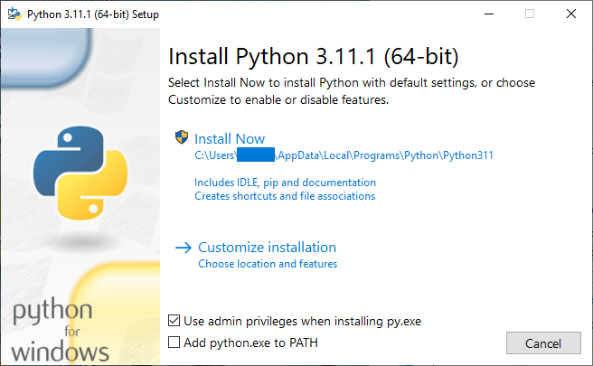
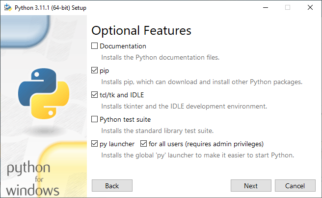
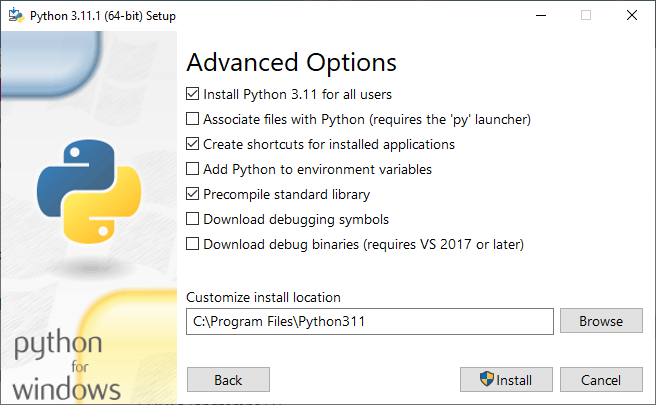
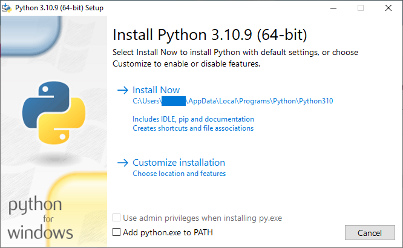
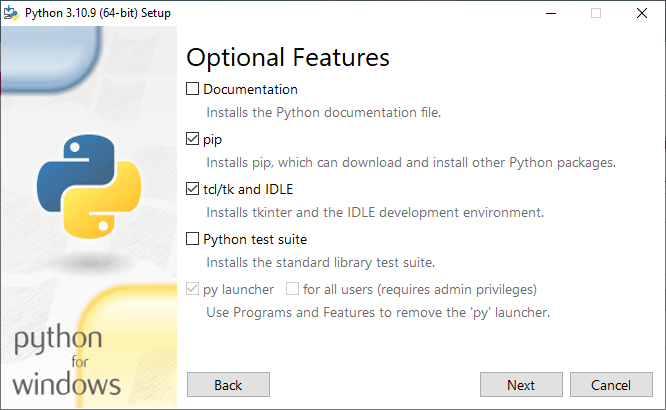
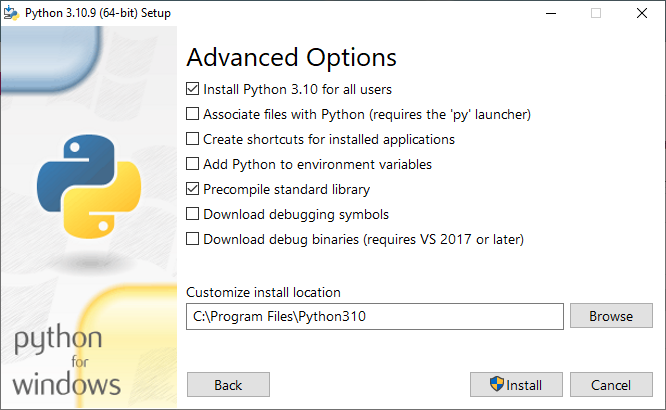
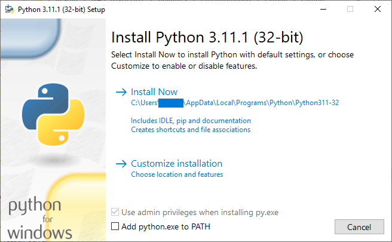
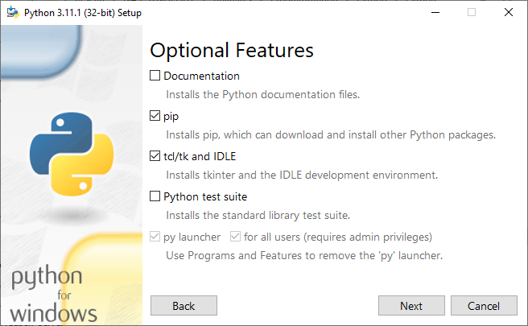
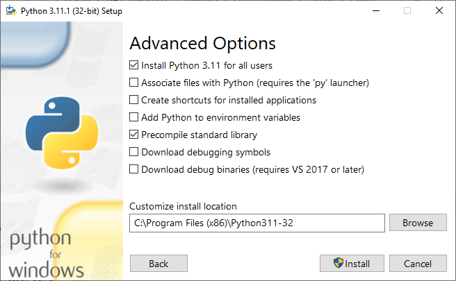

# Contributing

## Code of Conduct

As a contributor, you can help us keep the DomiChess contributors community open and inclusive. Please read and follow our [Code of Conduct](https://github.com/devfred78/domichess/blob/main/CODE_OF_CONDUCT.md).

## How to set up your Development Environment

If you want to contribute actively to the DomiChess project by proposing fixes or enhancements for the source code, you need to deploy a development environment on your own computer, equipped with Windows 10 or above.

For the DomiChess Project, the following tools are needed:

- Git (and a user account on GitHub)
- Python
- Poetry
- At least a text editor, even an IDE if you want (but this is not necessary)

### Git and GitHub

Git is a very popular, free and open source distributed version control system. As you have certainly noted, DomiChess code source is hosted by [GitHub](https://github.com/), an Internet hosting service for sofware development and version control using Git. So, usage of Git is highly encouraged (though not absolutely necessary) for contributing on a Github-hosted project like DomiChess.

Go to the [Git for Windows web site](https://gitforwindows.org/) to download the latest Git release, and install it on your computer.

During the same time, if not already made, create an account on [GitHub](https://github.com/) by following [those instructions](https://docs.github.com/en/get-started/signing-up-for-github/signing-up-for-a-new-github-account).

Once made, set up Git to be able to work in close coordination with your GitHub account by following [those instructions](https://docs.github.com/en/get-started/quickstart/set-up-git), especialy your username and your commit email address.

Your contribution to DomiChess project cannot be done by direct access to the repository, because you don't have write access to it by default. For that, you need to apply a "fork and pull request" workflow.

A fork is a new repository that shares code and visibility settings with the original “upstream” repository (here DomiChess). Forks are often used to iterate on ideas or changes before they are proposed back to the upstream repository, such as in open source projects or when a user does not have write access to the upstream repository.

You can contribute by submitting pull requests from your fork to the upstream repository.

To be able to contribute to DomiChess, you need to:

1. Fork the DomiChess repository: see [those instructions](https://docs.github.com/en/get-started/quickstart/fork-a-repo#forking-a-repository) for details
2. Clone your fork on your computer:
	- Open a terminal window and go to the location where you want the cloned directory
	- Type the following command (with your GitHub username instead of `<GITHUB_USERNAME>`:
		```batchfile
		git clone https://github.com/<GITHUB_USERNAME>/DomiChess
		```
		
		> This command expects you chose to clone your repository using HTTPS, and to keep the same repository name during the forking stage.
		> Adjust the command if you make a different choice.
3. Add the original repository as the `upstream` remote repository to be allowed to sync further changes made in the orginal repository with your local clone:
	```batchfile
	git remote add upstream https://github.com/devfred78/domichess.git
	```

### Python

You can find [here](https://www.python.org/downloads/windows/) all the Python releases for Windows.

For the following instructions, we assume that Python is not yet installed on your computer. In most cases, you'll need to install different versions of Python on your PC, so it is important to follow the steps to avoid bad mixes on your configuration. Of course, if you are an experienced user, you can apply other choices depending of your objectives. The process I present here assure you of obtaining a useful configuration without any particular issue.

First, download the last available installer suitable for your system (32 or 64-bit). Beware of downloading the **Installer** file and not the *embeddable* one.

Let's suppose it is Python 3.11.1.

Once downloaded, execute the installer, and the following window quickly appears:



Check `Use admin privileges when installing py.exe` and **uncheck** `Add python.exe to PATH` (if not already unchecked). Then click on `Customize installation`.

On the "Optional Features" window:



- Checking `tcl/tk and IDLE` is mandatory, since the DomiChess GUI makes an intensive use of the `tkinter` library, itself using `tk`
- Checking `pip`, `py launcher` and `for all users` is optional but recommended
- Leave the other boxes **unchecked**

Then click on the `Next` button.

On the "Advanced Options" window:



- Checking `Install Python 3.11 for all users` and `Precompile standard library` is highly recommended
- Checking `Create shortcuts for installed applications` is only usefull if you want to easily access to this version of Python from your desktop
- Leave the other boxes **unchecked**, even `Add Python to environment variables` (you will use Poetry to reach Python)

Please note the install location (here `C:\Program Files\Python311`), you will use it later during the virtual environment initialization.

Finally, click on the `Install` button, and leave the installer to do its job.

What happens next will depend on your needs, or more particularly the needs of the DomiChess version you want to work on.

Check, in the `pyproject.toml` file, the line `python` in the `[tool.poetry.dependencies]` section. If the indicated version is different from the one you just installed (here, 3.11), then you need to install it additionaly. Elsewhere, you can stop with Python installation and go directly to the next section (Poetry Installation).

Let's suppose the indicated version is `3.10`.

Download the suitable installer of this version from [the official downloading page](https://www.python.org/downloads/windows/).

Once downloaded, execute the installer, and the following window quickly appears:



Note that this time the `Use admin privileges when installing py.exe` option is uncheckable. So, simply **uncheck** `Add python.exe to PATH` (if not already unchecked), then click on `Customize installation`.

On the "Optional Features" window:



- Checking `tcl/tk and IDLE` is mandatory, since the DomiChess GUI makes an intensive use of the `tkinter` library, itself using `tk`
- Checking `pip` is optional but recommended
- Please note that this time the options `py launcher` and `for all users` are uncheckable, since `py` has been already installed by the previous Python installation.
- Leave the other boxes **unchecked**

Then click on the `Next` button.

On the "Advanced Options" window:



- Checking `Install Python 3.10 for all users` and `Precompile standard library` is highly recommended
- Checking `Create shortcuts for installed applications` is only usefull if you want to easily access to this version of Python from your desktop. If not you can leave this box **unchecked** safely
- Leave the other boxes **unchecked**, even `Add Python to environment variables` (you will use Poetry to reach Python)

Please note the install location (here `C:\Program Files\Python310`), you will use it later during the virtual environment initialization.

Finally, click on the `Install` button, and leave the installer to do its job.

### Poetry

Poetry is a powerful, easy-to-use packaging and dependency management tool.

To install it, please follow the instructions on the [official web site](https://python-poetry.org/docs/#installation).

Once made successfully, open a terminal window in the folder where you locally clone the source code of DomiChess, by typing `cmd` in the path line on the upper part of the Windows file explorer (where you can read, for instance, something like `PC > Documents > DomiChess > Source`).

Type the following command to create the suitable virtual environment for the project:

```batchfile
poetry env use <PATH_TO_PYTHON>
```

with `<PATH_TO_PYTHON>` the full path to the Python interpreter that you previously noted during the Python installation. For instance, it can be `"C:\Program Files\Python310\python.exe"` (with the quote marks). Be aware to provide the correct version of Python (refer to the `pyproject.toml` file).

Then, install the needed packages with the following command:

```batchfile
poetry install --sync
```

Or, if you want to build the final, deployable bundle for whatever reason during your contribution:

```batchfile
poetry install --with dev --sync
```

This command ensures that the locked dependencies in the `poetry.lock` file are the only ones present in the environment, removing anything that's not necessary.

To execute DomiChess, just run one of the following commands:

```batchfile
:: Execute with no output at all on the terminal
poetry run python start.py

:: Execute and display exceptions not handled by the program
poetry run python start.py --err

:: Execute and display log messages until INFO level
poetry run python start.py --info

:: Execute and display log messages until DEBUG level
poetry run python start.py --debug

:: It is possible to mix --err flag with --info or --debug flag
poetry run python start.py --info --err
poetry run python start.py --debug --err
```

For a deeper usage of Poetry, please refer to the [official documentation](https://python-poetry.org/docs/).

### Text Editor or IDE

No specific text editor is adviced for editing and modifying the source-code of DomiChess, since it is a little project.

Of course, it can be difficult to work on with the native Windows Notepad, even for this kind of project :-). If you don't really know what to use, please feel free to pick up and try out an editor among the following list (sorted in alphabetical order):

- [Eclipse](https://www.eclipse.org/) + [Pydev](https://www.pydev.org/)
- [Jupyter Notebook](https://jupyter.org/)
- [Notepad++](https://notepad-plus-plus.org/)
- [PyCharm](https://www.jetbrains.com/pycharm/)
- [Spyder](https://github.com/spyder-ide/spyder)
- [Sublime Text](http://www.sublimetext.com/)
- [Thonny](https://thonny.org/)
- [Vim](https://www.vim.org/)
- [Visual Studio Code](https://code.visualstudio.com/)


## Contributing workflow

(This section is widely, but also freely inspired by [this article](https://docs.github.com/en/get-started/quickstart/contributing-to-projects?tool=webui))

As said in the "Git and GitHub" section, your contribution to DomiChess project cannot be done by direct access to the repository, because you don't have write access to it by default. For that, you need to apply a "fork and pull request" workflow.

Assuming you followed the steps written in the "Git and GitHub section", the general workflow is:

1. Sync the `main` branch of your local clone with the corresponding branch in the upstream repository (original DomiChess repository):
	```batchfile
	:: Fetch the branches and their respective commits from the upstream repository
	git fetch upstream
	
	:: Check out your local main branch
	git checkout main
	
	:: Merge the changes from the upstream main branch
	git merge upstream/main
	```
	
	> If you want to work from another branch, replace `main` by the name of the desired branch on the upstream repository.
2. Create a branch to work on: assuming you want to code an amazing feature, type the following command on the terminal:
	```batchfile
	git checkout -b amazing_feature
	```
	
	> All further changes regarding this feature will be kept in this branch. You can make multiple parallel features or fixes on the same project, using different branch for each.
3. Make your changes:
	- Go ahead and make a few changes to the project using your favorite text editor
	- When you are ready to submit your changes, stage and commit your changes:
		```batchfile
		:: Tells Git that you want to include all your changes in the next commit
		git add .
		
		:: Takes a snapshot of those changes
		git commit -m "a short description of the change"
		```
		
		> Don't forget the dot (`.`) at the end of the command `git add .`
	- You can continue to make more changes, and take more commit snapshots.
	- When you are ready to push your changes up to GitHub, push your changes to the remote:
		```batchfile
		git push
		```
4. Create a Pull Request: see [those instructions](https://docs.github.com/en/pull-requests/collaborating-with-pull-requests/proposing-changes-to-your-work-with-pull-requests/creating-a-pull-request-from-a-fork)
5. Manage feedback: Pull Requests are an area for discussion. Reviewers should leave questions, comments, and suggestions. Reviewers can comment on the whole pull request or add comments to specific lines. You and your reviewers can insert images or code suggestions to clarify comments. For more information, see [those instructions](https://docs.github.com/en/pull-requests/collaborating-with-pull-requests/reviewing-changes-in-pull-requests).

	> You can continue to commit and push changes in response to the reviews. Your pull request will update automatically.
6. Merge the Pull Request: only users with write permission in the repository can merge pull requests. In the case of the DomiChess project, this capability is only given to the owner of the repository. When your Pull Request is ready to be merged, please be patient, and you will seen soon your amazing feature being incorporated into the main branch, meaning that it will be available in the next release !

## Format your code

The code format has to be [PEP 8](https://peps.python.org/pep-0008/) compliant. To do so, you can simply go to the root of your local clone repository and type the following command:

```batchfile
poetry run black .
```

## Build the executable

To bundle all the source code and its dependencies (including Python itself) into a single executable file, just launch the following batch script:

```batchfile
build.bat
```

This command calls [Pyinstaller](https://pyinstaller.org/en/stable/index.html), and takes the specific parameters from the [build.spec](https://github.com/devfred78/domichess/blob/main/build.spec) file.

The build process releases a file in the `dist` folder, named `domichess_X.Y.Z_<64/32>bit.exe`, with `X.Y.Z` the version number found in the [pyproject.toml](https://github.com/devfred78/domichess/blob/main/pyproject.toml) file, and 32 or 64 bit according to the platform where the build has performed.

> If an 'EndUpdateRessource' exception raises, don't hesitate to execute `build.bat` again and again, until its successful issue.

## Build a 32-bit executable on a Windows 64-bit platform

It is completely possible to build a 32-bit executable of DomiChess with Windows 64-bit. Furthermore, it is possible to build 32-bit **and** 64-bit executables on the same platform, assuming Windows is 64-bit.

To do that, you need to install both 64-bit and 32-bit editions of Python, following the hereafter steps **in that order**:

1. Install at least on version of the 64-bit edition of Python
> To do this, just follow instructions in the *Python* section.
2. Install `Poetry`
> On the same way, just follow instructions in the *Poetry* section
3. install one or more versions of the 32-bit edition of Python
> For that, follow the instructions just below

### Install additional 32-bit edition of Python

Let's suppose the aimed version is `3.11.1`.

Download the suitable installer of this version from [the official downloading page](https://www.python.org/downloads/windows/).

Once downloaded, execute the installer, and the following window quickly appears:



Note that this time the `Use admin privileges when installing py.exe` option is uncheckable. So, simply **uncheck** `Add python.exe to PATH` (if not already unchecked), then click on `Customize installation`.

On the "Optional Features" window:



- Checking `tcl/tk and IDLE` is mandatory, since the DomiChess GUI makes an intensive use of the `tkinter` library, itself using `tk`
- Checking `pip` is optional but recommended
- Please note that this time the options `py launcher` and `for all users` are uncheckable, since `py` has been already installed by the first, 64-bit Python installation.
- Leave the other boxes **unchecked**

Then click on the `Next` button.

On the "Advanced Options" window:



- Checking `Install Python 3.11 for all users` and `Precompile standard library` is highly recommended
- Checking `Create shortcuts for installed applications` is only usefull if you want to easily access to this version of Python from your desktop. If not you can leave this box **unchecked** safely
- Leave the other boxes **unchecked**, even `Add Python to environment variables` (you will use Poetry to reach Python)

Please note the install location (here `C:\Program Files (x86)\Python311-32`), you will use it later during the virtual environment initialization.

Finally, click on the `Install` button, and leave the installer to do its job.

### Clone (again) your forked repository

The cleaner way to work in the same time with both 32-bit and 64-bit editions of DomiChess, is to use two independant, separated (Python) virtual environments. If you followed the instructions written in the main *Git*, *Python* and *Poetry* sections, you've got already the 64-bit environment.
To get the 32-bit one:
1. Create a separated folder dedicated for the 32-bit workspace, **outside** the 64-bit one
> For instance, you can call it `domichess-32b`
2. Clone again the repository in this folder:
	- Open a terminal window and go to the location where you want the cloned directory
	- Type the following command (with your GitHub username instead of `<GITHUB_USERNAME>`:
		```batchfile
		git clone https://github.com/<GITHUB_USERNAME>/DomiChess
		```
		
		> This command expects you chose to clone your repository using HTTPS, and to keep the same repository name during the forking stage.
		> Adjust the command if you make a different choice.
3. Add the original repository as the `upstream` remote repository to be allowed to sync further changes made in the orginal repository with your local clone:
	```batchfile
	git remote add upstream https://github.com/devfred78/domichess.git
	```

### Create (again) a Python virtual environment

Stay in the 32-bit directory and type the following command to create the suitable virtual environment:

```batchfile
poetry env use <PATH_TO_PYTHON>
```

with `<PATH_TO_PYTHON>` the full path to the 32-bit Python interpreter that you previously noted during the Python installation. For instance, it can be `"C:\Program Files (x86)\Python311-32\python.exe"` (with the quote marks). Be aware to provide the correct version of Python (refer to the `pyproject.toml` file).

Then, install the needed packages with the following command, with capability to generate the deployable bundle:

```batchfile
poetry install --with dev --sync
```

This command ensures that the locked dependencies in the `poetry.lock` file are the only ones present in the environment, removing anything that's not necessary.

### Generate the 32-bit executable

First, synchronise your cloned repository with the upstream one, by typing the following commands:

```batchfile
:: Fetch the branches and their respective commits from the upstream repository
git fetch upstream

:: Check out your local main branch
git checkout main

:: Merge the changes from the upstream main branch
git merge upstream/main
```

To bundle all the source code and its dependencies (including Python itself) into a single executable file, just launch the following batch script:

```batchfile
build.bat
```

This command calls [Pyinstaller](https://pyinstaller.org/en/stable/index.html), and takes the specific parameters from the [build.spec](https://github.com/devfred78/domichess/blob/main/build.spec) file.

The build process releases a file in the `dist` folder, named `domichess_X.Y.Z_32bit.exe`, with `X.Y.Z` the version number found in the [pyproject.toml](https://github.com/devfred78/domichess/blob/main/pyproject.toml) file.

> If an 'EndUpdateRessource' exception raises, don't hesitate to execute `build.bat` again and again, until its successful issue.
