# Usage of DomiChess

## Disclaimer

Strickly speaking, in chess terminology, one **move** consists of a turn by each player. A turn taken by one of the players is a half-move or a **ply**. Thus, after 10 moves in a chess game, 20 plies have been completed - 10 by white and 10 by black.

But, in a context without ambiguity, the use the word *move* as a synonym of *ply* is tolerated. That is the rule chosen for the writing of the current document. In case of ambiguity, the terms **half-move** or **full-move** are used explicitly.

In all cases, the word **turn** is a synonym of *full-move*.

## Quick Overview

When you execute DomiChess, you get something like that:

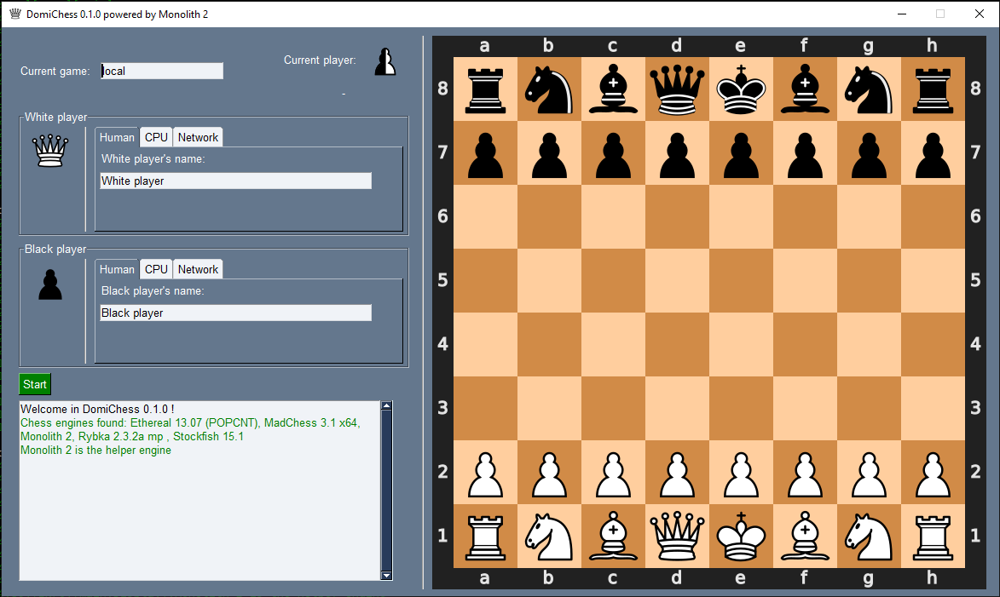

As you can see, this main window is divided in several areas:

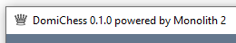 The caption of the window, indicating the DomiChess version. If one chess engine is available, it is used as the helper engine. In this case, the caption is completed with "powered by" following by the name of the engine (here Monolith 2). If several engines are available, the helper engine is chosen randomly among them.

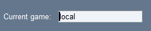 You can optionaly give a name to your game, or leave the default name provided by the program.

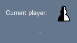 This area gives the color and the name of the current player. If no game is on-going, a default, bi-colored pawn is displayed.

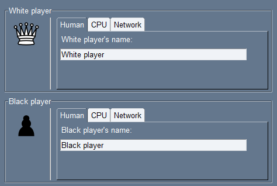 Here you can personnalize the opponents. For a human, local player, you can optionaly give a name (or leave the default's one). You can also switch to an AI or a remote opponent, with specific settings available for each one. Please note that the piece representing the player is chosen randomly each time the program begins.

 The `Start` button, to begin the game.

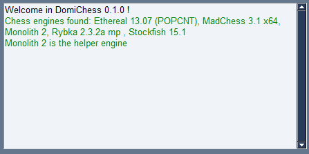 Some pieces of information are displayed here before and during the game. For the moment, DomiChess greets you, and the list of the found chess engines (with the helper engine randomly chosen) is provided.

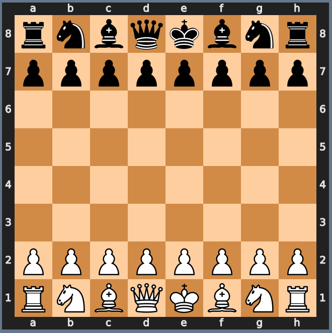 The chess board, by far the main area of the whole window, where all the game activity is focused on :-).

Well, let's continue and begin our...

## First Game

Let's give a more appropriate name for our first game that will be a very long and exhausting battle: 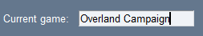.

Let's follow the same thematic for the name of the protagonists: 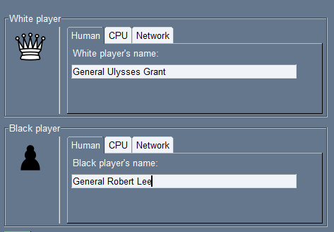.

Don't wait much longer, and let's click the green button to start the game ! 

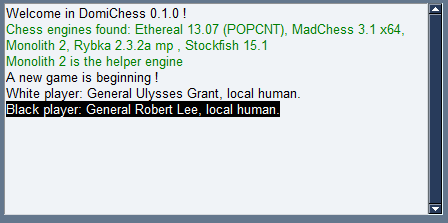 On the console, DomiChess informs us that a new game has began, with General Grant as the white player, and General Lee as the black one. Both are local humans, meaning that they plays on the same computer and are not chess engines.

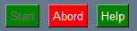 Just next to the `Start` button, 2 new buttons have made an appearance: `Abord` to stop the game before it's "natural" end, and `Help` to ask for help during the game. Please note that the `Start` button is now inactive, since it makes no sence to start a game already started...

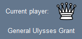 As we can see, General Grant is about to play !

In order to play, Grant has just to click on the desired piece on the board area. Let's assume he wants to play the `e2` pawn:

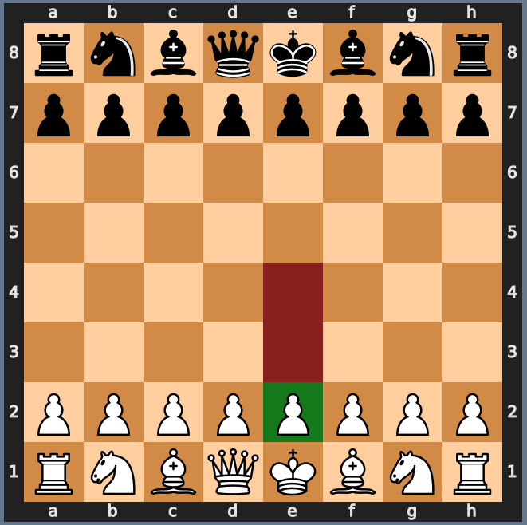

The square of the pawn has turned into green, and the squares turning into red are the possible, legal destinations of the pawn according to the chess rules. With DomiChess, illegal moves are forbidden and impossible to realize.

In our case, Grant wants to put the pawn on the `e4` square, et here it is !

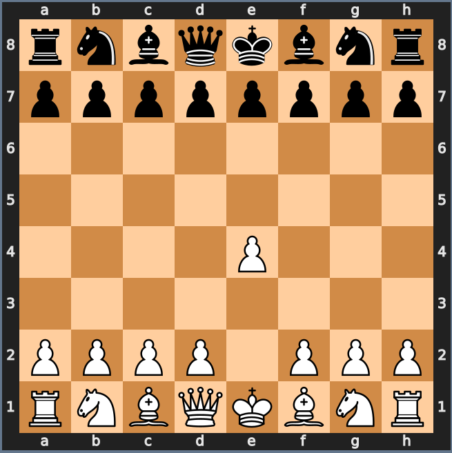

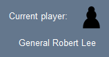 It's now time to General Lee to respond !

But... what exactly to do ? Lee is hesitating: the knight in `b8` ? Or the pawn in `d7` ? Or something else ? Lee needs an advisor ! And that's exactly what he obtains by clicking on the  button.

After clicking on this button, the helper engine analyzes the game, and provides an advice in few tenths of a second, taking the form of a blue arrow indicating the move to do:

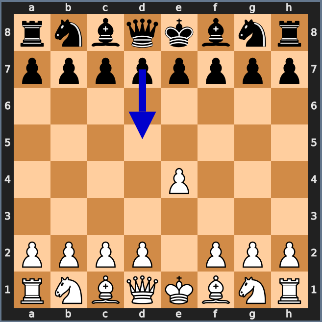

Of course, Lee is free to follow this advice or not. Let's assume this time, he listens to his advisor and makes the move he was advised :-).

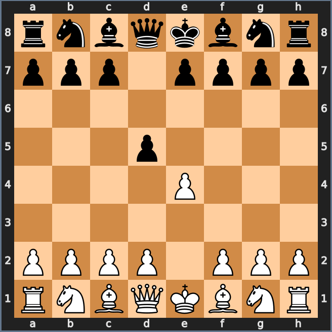

Meanwhile, the full-move has been recorded on the console, using the standard English [algebraic notation](https://en.wikipedia.org/wiki/Algebraic_notation_(chess)):

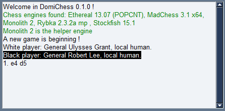

After ten turns, the console can resemble the following:

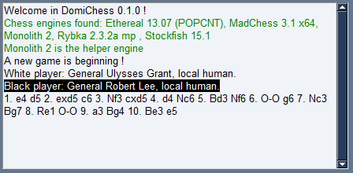

And so is the corresponding board:

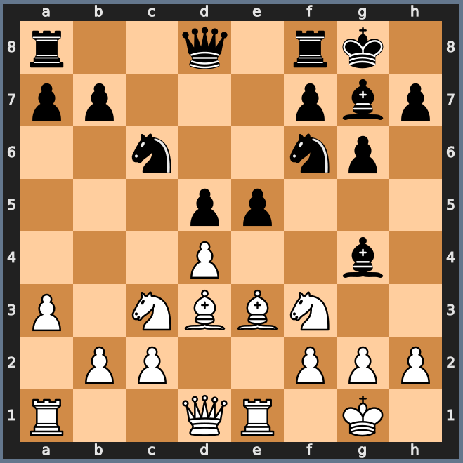

A couple of turns later, let's suppose a position of claimable draw is reached. In this case, DomiChess displays an orange button just next the Help one, to give to the involved opponent the ability to claim a draw:

DomiChess detects the following draw conditions:

- Automatic draws:
	- Stalemate: no more possible legal move
	- Fivefold repetition: the same position occurs five times during the course of the game
	- Seventy-five-move rule: no pawn has moved and no capture has been made during the previous 75 turns
	- Insufficient material left to checkmate
- Claimable draws:
	- Threefold repetition: the same position occurs three times during the cousre of the game
	- Fifty-move rule: no pawn has moved and no capture has been made during the previous 50 turns

Read this [wikipedia article](https://en.wikipedia.org/wiki/Draw_(chess)) to learn more about draws in chess.

If the claim is not made on the move in which the condition occurs, the player forfeits the right to make the claim. In this case, the game continues.

The game finally ends by a checkmate ! A window appears to inform the players of the game's conclusion:

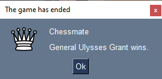

Congratulations, General Grant !

## Players Configuration

Each player can be independantly initialized as "human", "CPU" or "Network".

### Human Player

A **human** player is, as its name means, a human beeing playing locally, on the computer executing DomiChess.

The configuration of a human player is very simple, since you can only personnalize its name. Of course, the name has no effect on the game itself, it is just an informative item.

### CPU Player

**CPU** acts as *Central Processing Unit*, and is used here to address a chess engine previously installed on the local computer.

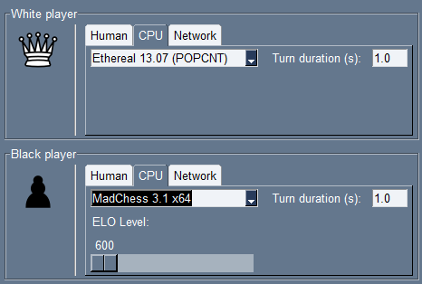

You choose the engine among a drop-down list gathering all chess engines installed on the computer (see the prerequisites section in the [README file](https://github.com/devfred78/domichess/blob/main/README.md) for more information about installing the chess engines).

You can also modify the **maximum** duration the engine spends calculating its move.

If the selected engine provides this possibility, you can adjust its [ELO](https://en.wikipedia.org/wiki/Elo_rating_system) level between the bounds permitted by the engine.

### Network Player

The **network** player is a remote opponent, located on another device, on the same local network, or elsewhere on Internet. He/She/It can be either a human or an engine.

This functionnality is not yet implemented.